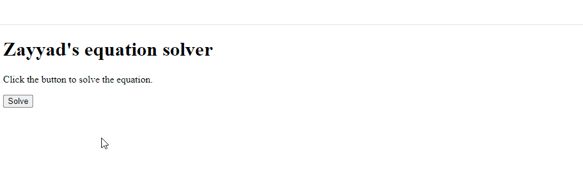
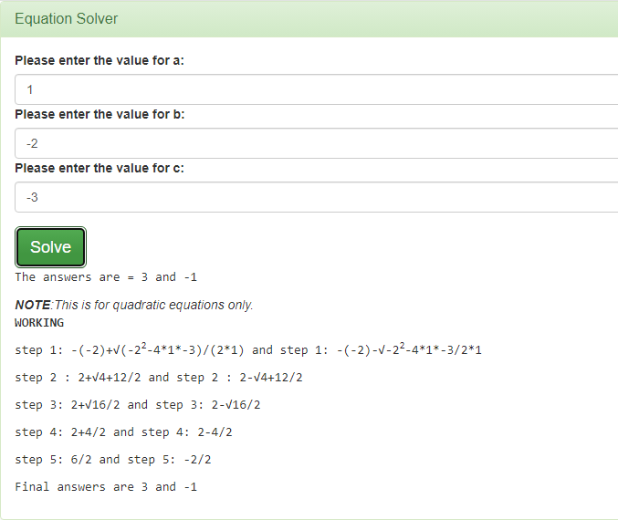

I can't remember the first lines of code I wrote. But I do remember the first real project I worked on.

It was late 2013, and my cousin, Hamid Abdulmalik Alhassan, (a veteran software developer), gave me a task: Create a program to solve Quadratic equations in HTML. And yes, he deliberately said HTML to see how I would handle the challenge. Alhamdulillah, after some research, I realised that the only way I could build the equation solver was to use JavaScript for the logic, and HTML for the user interface.

After learning the basic JavaScript I needed, and a lot of research, I got the first working version out:



And here's the code:
```html
<!DOCTYPE html>
<html>
<body>
<h1>Zayyad's equation solver</h1>
<p>Click the button to solve the equation.</p>

<button onclick="solveEquation()">Solve</button>

<p id="quadratic"></p>

<script>
function solveEquation()
{
var equation;
var equation2;
var a=prompt("Please enter a",2);
var b=prompt("Please enter b",6);
var c=prompt("Please enter c",-80);//default values for a,b,c
var myArray= [a,b,c];

if (a=myArray[0])/*a is the fist array element so the code will always execute*/
  {
  equation= ((-1*b) + Math.sqrt((b*b) - 4*a*c))/ (2*a);//quadratic formula
 equation2= ((-1*b) -
Math.sqrt((b*b) - 4*a*c))/
(2*a);//second answer gotten
 document.getElementById("quadratic").innerHTML=equation+" or "+equation2 ;
  }
}
</script>

</body>
</html>
```

Seeing this again brought back nice memories and reminded me that I once wrote code without giving spaces between equal signs; something I would never do today. 

Anyway, the program works, but I made a few mistakes:

1. **There's no need for an always `true` condition:** I thought I needed a condition for the rest of the code to run, so I stored the variables `a`, `b`, and `c` in an array. Then I checked if `a` is the first element of `myArray` (it always is). I later realised that there was no need for this when I worked on later versions of the equation solver.

2. **That's not how to check for equality in JavaScript:** I was still new to programming, so I wrote `=` instead of `==`. This code works, but not in the way I understood it. It first re-assigns `myArray[0]` to `a`, and *then* checks if that value is [truthy](https://developer.mozilla.org/en-US/docs/Glossary/Truthy) (not `false`, `NaN`, `undefined`, `null`, e. t. c). Since the `prompt()` function always returns a string, and strings are truthy, the condition will always evaluate to `true`.

In short, I made some logical mistakes when writing the program, but it works because the syntax is correct. JavaScript allows you to get away with a lot, which makes it easy for you to introduce bugs. With great power comes great responsibility.

The equation solver has one important limitation; It can't handle equations that have complex roots. So if you're studying university-level algebra, I suggest you use something else.

I upgraded the equation solver a few times. Here's the latest version:


I made one with Bootstrap too:



You can check out [all versions of the equation solver]() on GitHub

I think it'll be fun improving it now that I know more about web dev and algebra. Let's see how it goes.

And that's the story. I'm grateful to Allah, my cousin, and all the people (online and offline) that I've learned from and continue to learn from. It's been a wonderful journey so far and I'm excited for what the future holds. 