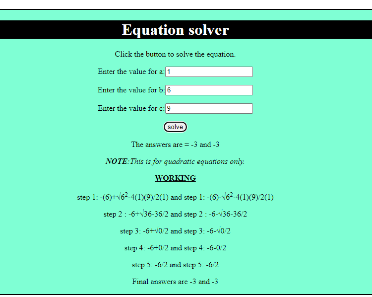

I can't remember the first lines of code I wrote. But I do remember the first real project I worked on.

It was in late 2013, and my cousin, Hamid Abdulmalik Alhassan, a veteran programmer, gave me a task: Create a program to solve Quadratic equations in HTML. And yes, he deliberately said HTML to see how I would handle the challenge. Alhamdulillah, after some research, I realised that the only way I could build the equation solver was using JavaScript (for the logic), and HTML (for the UI).

After learning the basic JavaScript I needed, and a lot of research, I got the first working version out:


And here's the code:
```html
<!DOCTYPE html>
<html>
<body>
<h1>Zayyad's equation solver</h1>
<p>Click the button to solve the equation.</p>

<button onclick="solveEquation()">Solve</button>

<p id="quadratic"></p>

<script>
function solveEquation()
{
var equation;
var equation2;
var a=prompt("Please enter a",2);
var b=prompt("Please enter b",6);
var c=prompt("Please enter c",-80);//default values for a,b,c
var myArray= [a,b,c];

if (a=myArray[0])/*a is the fist array element so the code will always execute*/
  {
  equation= ((-1*b) + Math.sqrt((b*b) - 4*a*c))/ (2*a);//quadratic formula
 equation2= ((-1*b) -
Math.sqrt((b*b) - 4*a*c))/
(2*a);//second answer gotten
 document.getElementById("quadratic").innerHTML=equation+" or "+equation2 ;
  }
}
</script>

</body>
</html>
```

Seeing this again brought back some nice memories, but it also made me cringe. How did I not give spaces between equal (=) signs 😬? 

Anyway, the program works, but there were/are a few things wrong with it. It's okay if you didn't notice, so let's walk through the code. 

First, I stored the variables `a`, `b`, and `c` in an array. I can't remember why I did that. But the next line is worse.
For some reason, I put `if(a=myArray[0])` as a condition for the calculation to execute. 
There's two things wrong with this:
1. **There's no need for an always true condition.** I wanted the code to execute if `a` is the first element of `myArray` (it always is). I thought I needed a condition for the rest of the code to run.

2. **That's not how to check for equality in JavaScript.** I was still new to programming, so I wrote `=` instead of `==`. This code works, but not in the way I understood it. It first re-assigns `myArray[0]` to `a`, and *then* checks if that value is truthy (not false, NaN, undefined, null, e. t. c). Since the `prompt()` function always returns a string, and strings are truthy, the condition will always evaluate to `true`.


In short, the program is partly wrong (logically), but it's syntactically correct. 
This code shows that I didn't fully understand how some programming constructs worked. It also showed that JavaScript allows you to get away with a lot. The way JavaScript deals with evaluating boolean expressions helped a lot.

The equation solver also had a limitation, It can't handle equations that have complex roots. 

I upgraded the equation solver a few times. Here's the latest version:


I made one with Bootstrap too:


I think it'll be fun improving it now that I know more about web dev and algebra. Let's see how it goes.

And that's the story. I'm grateful to Allah, my cousin, and all the people (online and offline) that I've learned from and continue to learn from. It's been a wonderful journey so far, and I'm excited for what the future holds. 