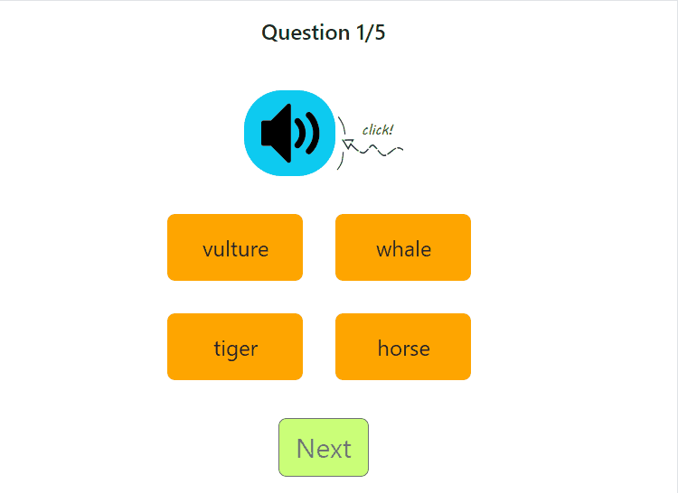

I finally got an excuse to learn unit testing. With the grace of Allah, I built 2 quiz games where the player listens to a sound and matches it with the correct option. Here's what one of the games look like:

When I started working on the last quiz game, I realised I was tired of copying the quiz generation code from the one I built earlier. Though I had to tweak some of the details for each quiz, I used the same pattern for generating questions. I also ran into some weird cases, like the code generating more questions and options than I wanted, or generating questions without answers in them.
I took all these issues as a sign to build a sound MCQ (multiple-choice questions) utility, and use the opportunity to learn unit testing.

## Why Unit Testing?

My unit testing journey before this involved reading many articles and opinions about unit testing online, and trying out one tutorial. Through my haphazard research, I learned that writing code with unit tests is a good way to make sure your functions and classes work the way you want them to, instead of writing code and hoping it works well in all cases. Since I need predictable output when generating questions, unit testing seemed like the best way to go.

## Choosing a Testing Framework

I wanted to use Vitest because I've had a good experience building projects with Vite lately; Vite's build speed makes me happy. In the end, I chose Jest because it's battle-tested. As a newbie to unit testing, it makes more sense to start with simple, more established tools since they have the community and resources to help you when you get stuck.

So, I downloaded Jest and got to work.

In the [next article](/blog/unit-testing-2), I'll talk about the mistakes I made writing my first tests, In shaa Allah. 