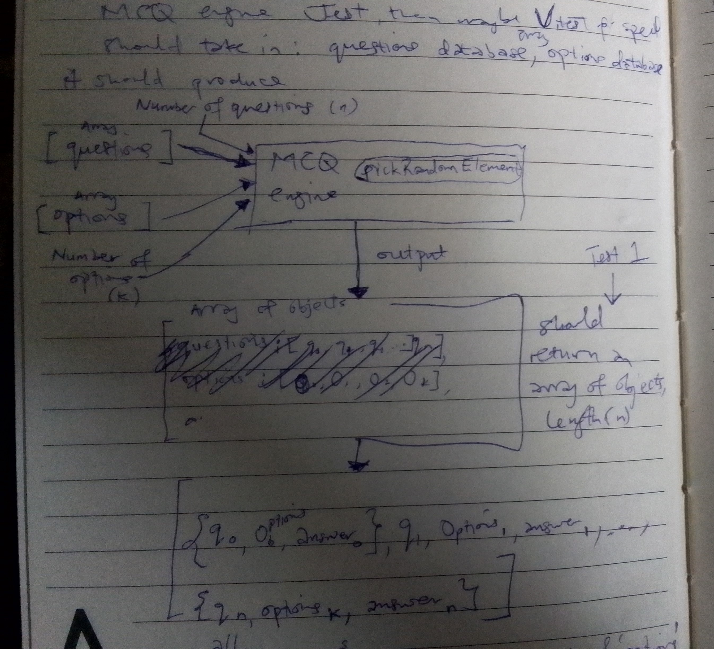
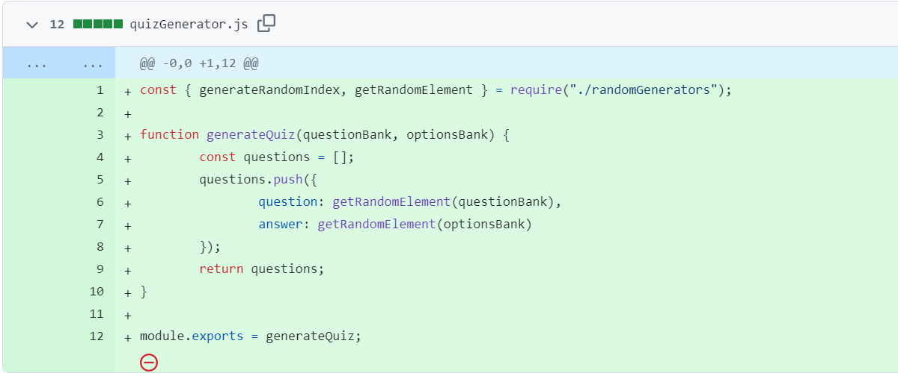
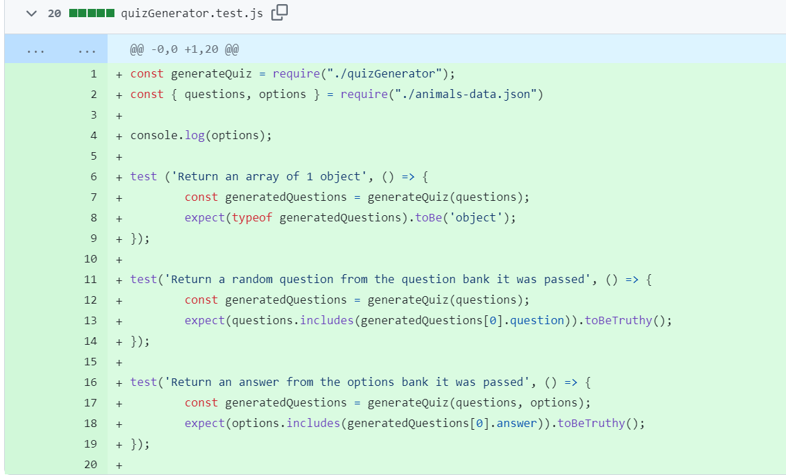
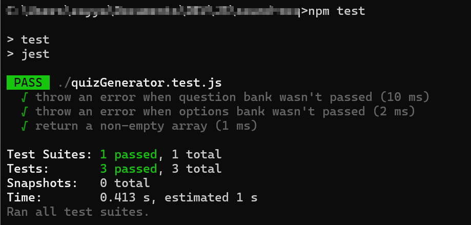
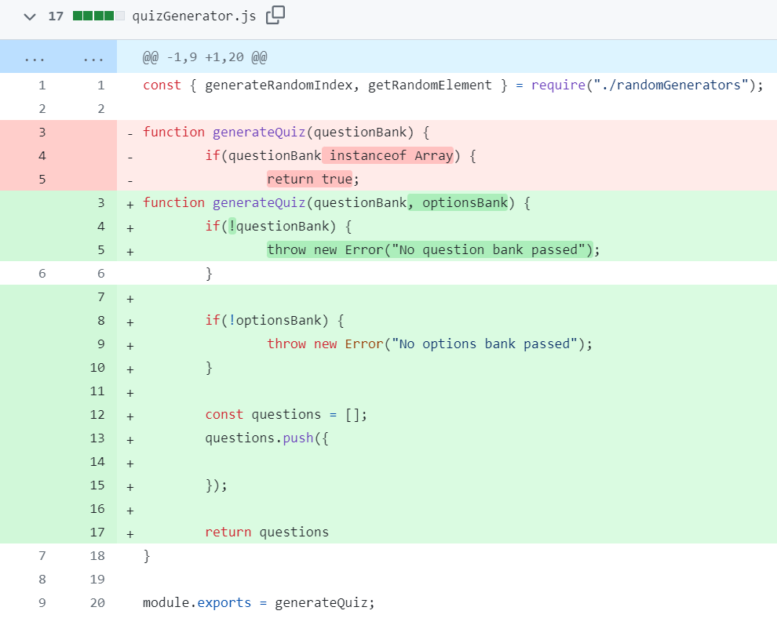

The [previous post](./unit-testing-1) ended with me installing Jest. To understand this article better, here's the blueprint of the quiz generator I drew before writing tests. It contains all the expected inputs, output and data types.

**Inputs:** `questions`, `options`, `number of questions`, `number of questions`

**Output:** An array of objects with length = number of questions. Each object contains a `question`, `answer`, and `options` array

## False Positives

I'll admit that I forgot to look at the diagram when I started writing the tests. But that wasn't the reason I ran into trouble. The first 3 tests I wrote passed; the fourth one passed too, but it caused the first 3 to fail. I remember someone describing this scenario as something you should avoid when unit testing. If newer tests fail, you're not writing the tests correctly. So I went back to the diagram to see what I was getting wrong.

To be honest, I can't remember exactly what caused the problem, but I wrote a note to myself that said "Incremental building blocks. Start with what is static". I can conclude that I was writing tests for parts of the code that would change, so, I started afresh. Here's how it looked:

*Implementation* (I forgot to take screenshots from VS Code)

*Test*

I ran into the same problem. But this time, I was testing very specific outputs from the function without checking the inputs. These failures told me that something was wrong with my mental model of "red-green-refactor". I went back to the diagram again.

## The Actual Solution

Alhamdulillah, after much instropection, it became clear that I was supposed to validate the inputs first, and not the output. I started from scratch, and this time, I was happy to see that the newer tests weren't breaking the older ones.

Here's the implementation:

In the next post, I'll cover more Jest-specific topics and funny incidents with JavaScript array functions, in shaa Allah. 